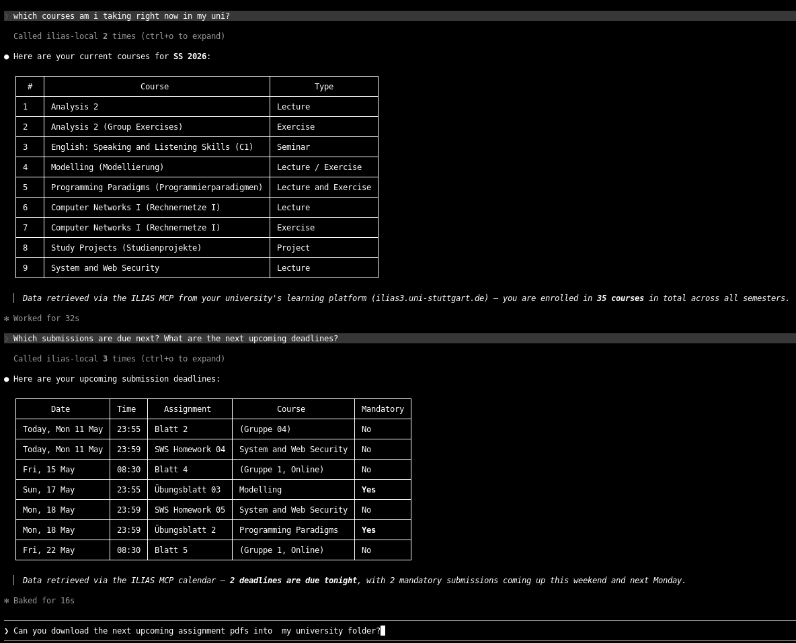

# ILIAS MCP

Production-oriented MCP server for ILIAS login, enrolled course listing, dashboard news, repository crawling, file downloads, and exercise submission management.

## Tools

### General

- [login](#login): authenticate against ILIAS
- [list_courses](#list_courses): list enrolled courses with title, URL, and ref ID
- [server_info](#server_info): show non-sensitive runtime config
- [list_calendar_events](#list_calendar_events): list agenda events for a day
- [list_dashboard_news](#list_dashboard_news): list personal dashboard news from ilPDNewsGUI

### Repository

- [list_repository_items](#list_repository_items): list child objects below a ref ID
- [get_repository_item_details](#get_repository_item_details): fetch page details and detect download URLs
- [get_file_content](#get_file_content): download file content by ref ID; PDFs are parsed to text with pypdf
- [crawl_repository](#crawl_repository): recursively walk a course or folder and return a flat tree
- [download_file](#download_file): download one file object by ref ID
- [download_repository_files](#download_repository_files): recursively download matching files and preserve ILIAS folders

### Exercise Submission

- [list_exercise_assignments](#list_exercise_assignments): list assignments (Übungsblätter) for an exercise object by ref ID
- [submit_exercise_file](#submit_exercise_file): upload a local file as a submission for an assignment
- [list_submitted_files](#list_submitted_files): list already submitted files with their delivery IDs
- [delete_submitted_files](#delete_submitted_files): delete submitted files by delivery ID

### Team Management

- [list_team_members](#list_team_members): list current submission team members
- [add_team_member](#add_team_member): add a user to the submission team by ILIAS login name
- [remove_team_member](#remove_team_member): remove a team member by user ID
- [search_users](#search_users): search ILIAS users by name fragment to find their login name

## Demo



The demo shows this MCP server being used from Claude Code with authorized
access to a user's own ILIAS courses. The final prompt about downloading
assignment PDFs is included only as a capability demonstration; any actual use
must respect copyright, course rules, and the permissions granted for the
material. It must not be read as encouragement to scrape ILIAS, perform mass
downloads, or create unnecessary load on university infrastructure.

## Setup

```bash
python3 -m venv .venv
source .venv/bin/activate
pip install -e .
cp .env.example .env
```

Edit [.env.example](.env.example) / `.env` and set your credentials.
`ILIAS_DOWNLOAD_DIR` is optional and controls where `download_file` and
`download_repository_files` store files locally.

## Run

```bash
source .venv/bin/activate
ilias-mcp
```

## Notes

- Server keeps a session in memory while process is running.
- On process restart, login is re-established on demand.
- Downloads use the official ILIAS file routes used by the Stuttgart fork, including ilObjFileGUI sendfile and goto.php file download routes.
- Start with [list_courses](#list_courses), then call [crawl_repository](#crawl_repository) or [download_repository_files](#download_repository_files) with the course ref ID.
- For exercise submission: use [list_exercise_assignments](#list_exercise_assignments) to get `ass_id` values, then [submit_exercise_file](#submit_exercise_file) with the local file path.
- For team management: use [search_users](#search_users) to find a teammate's login name, then [add_team_member](#add_team_member).

## ❗ Responsible Use ❗

Use this server only for your **own legitimate and authorized course access**.
Do not use it for **denial-of-service behavior**, **excessive automated
requests**, **mass downloads**, **high-frequency polling**, or any other activity
that could create **unnecessary load on ILIAS**, disrupt university
infrastructure, or violate university rules.

Course material such as **slides, exercise sheets, submissions**, and other
**personal or copyrighted data** must not be shared, republished, uploaded
elsewhere, or used outside the intended course context without the required
permission.
